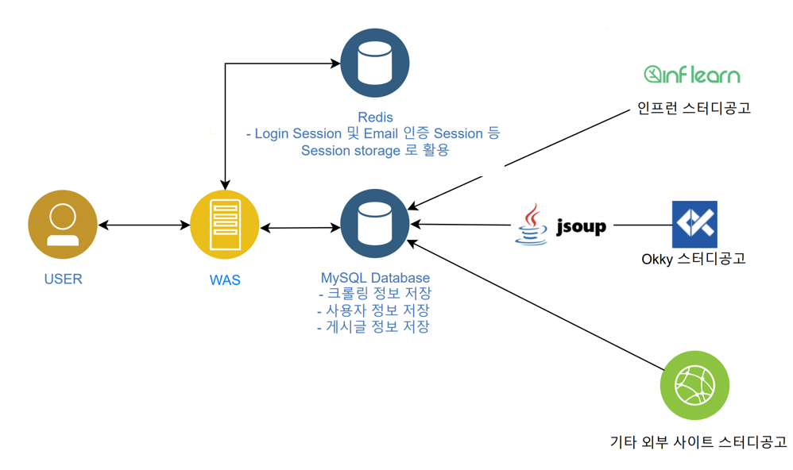

# Stduy Planet (스터디 모집 , 지원 플랫폼)

## Study Planet 이란? 
개발자를 포함한 다양한 학생들이 스터디 공고를 올리고, 스터디를 지원할 수 있도록 해주는 웹사이트 플랫폼입니다.
뿐만 아니라 외부 사이트들의 스터디 공고도 취합하여 한눈에 볼수 있도록 대쉬보드 형태로 개발하는 것을 목표로 하고 있습니다. 
---

## Project 기간

2022/01/16 ~ 진행중

---

## 목차 
- 요구사항 정리 및 개발 현황 
- 아키텍쳐
- 기술 스택 

---
##  요구사항 정리 및 개발 현황   

- 외부 third party 사이트로부터 스터디 공고를 크롤링하여 내부 DB 에 저장한다. [완료] 
- 크롤링 담당 background thread 실행 주기는 매일 밤 1:00시로, 24시간 이전의 데이터를 수집한다.[완료]
- 사용자로부터 이메일 인증을 받아, 회원가입 프로세스를 진행한다. [완료]
- 사용자는 게시글을 작성,수정,삭제할수 있어야 한다.[진행중]
- 사용자는 대쉬보드형태로 스터디 공고 업데이트 사항을 조회할 수 있어야 한다.[개발예정]
- 사용자는 카카오,구글 소셜 로그인을 통해서 회원가입 프로세스를 진행할 수 있어야 한다. [개발예정]
- 사용자 이메일 인증 세션 , 로그인 세션정보는 Redis 를 session storage로 활용해 저장한다. [개발예정] 
---

## 아키텍쳐 구조

---

## 프로젝터에 사용된 기술들 

- Programming language : Java(Jdk 11 version) ,Javascript(ES6),Typescript 
- Framework : Spring Boot , Spring Security 
- database : mysql , redis(예정)
- crawling library : Jsoup
- deployment : AWS ec2 (예정)

---

## API 명세서
- swagger 사용 예정
---

## Contributors
- devcs96 (backend)

---

