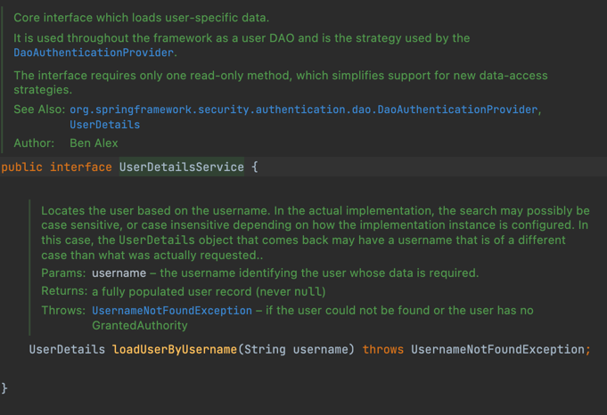
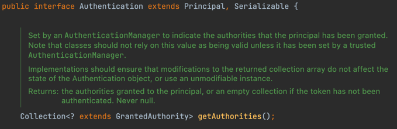
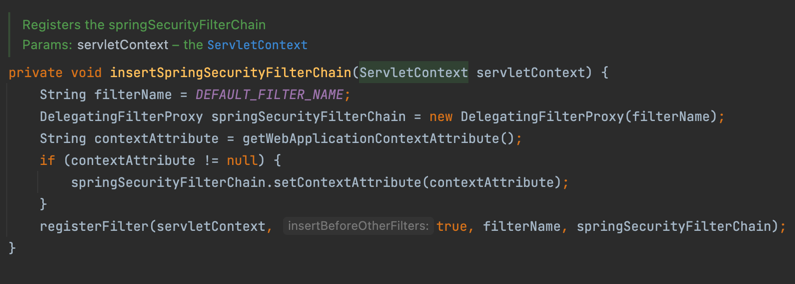

## Architecture and Implementation 

- spring security에서 사용되는 핵심적인 인터페이스,클래스,개념들이 있다.

### SecurityContextHolder , SecurityContext , Authentication Objects

- SecurityContextHolder : 현재 application의  security context 담고 있는 객체로 ThreadLocal 을 사용해 context를 보관한다. 즉 동일 thread 내에서는 항상 접근이 가능하다. 
- SecurityContextHolder를 통해서 현재 인증된 사용자의 정보에 접근할 수 있다.  정확히는 SecurityContextHolder내 Authentication.getPrincipal()로 꺼내서 접근할수 있다.
```java
Object principal = SecurityContextHolder.getContext().getAuthentication().getPrincipal();

if (principal instanceof UserDetails) {
  String username = ((UserDetails)principal).getUsername();
} else {
  String username = principal.toString();
}
```
- 대부분의 security authentication 절차는 userDetails 객체를 principal 로 반환한다고 한다.  
- userDetails객체는 개발자가 직접 생성하는게 아니라 UserDetailsService 통해서 인증이 성공하면 반환된다.


* 주의할점은 UserDetailsService자체가 인증을 수행하는게 아니라는 점이다. reference 에 따르면 userDetailService 는 순수한 Dao 이며 인증을 수행하는 주체는 AuthenticationManager class이다. 

reference 문서를 그대로 인용하면 다음과 같다.

<blockquote>
There is often some confusion about UserDetailsService. It is purely a DAO for user data and performs no other function other than to supply that data to other components within the framework. In particular, it does not authenticate the user, which is done by the AuthenticationManager. In many cases it makes more sense to implement AuthenticationProvider directly if you require a custom authentication process.
</blockquote>


- 인증성공뒤에는 UserDetails가 Authentication객체에 담기고, Authentication객체가 SecurityContextHolder에 담긴다. 그리고 SecurityContextHolder내에 SecurityContext 가 담긴다. 

### GrantedAuthority

- Authentication 의 getAuthorities method 는 GrantedAuthority Colletion을 반환하는데, 이는 인증된 사용자의 권한을 나타내는 객체이다. 



## Authentication 

- 이제 구체적으로 spring security에서 인증절차가 어떻게 수행되는지 


## 
- spring security 는 AbstractSecurityWebApplicationInitializer class를 통해서 기본적으로 spring security chain을 등록해준다. 



- application의 모든 url요청전에 spring security filter chain을 거친 뒤 요청 된다. 

## HttpSecurity : spring security 설정 

```java
@Configuration
@EnableWebSecurity
public class SecurityConfig extends WebSecurityConfigurerAdapter {
    protected void configure(HttpSecurity http) throws Exception {
        http
                .authorizeRequests()
                .anyRequest().authenticated()
                .and()
                .formLogin()
                .and()
                .httpBasic();
    }
}
```

위와 같은 형태로 spring security를 설정할 수 있다.

## login Page 설정 

```java
http.formLogin()
    .loginPage("/login") //login url 경로 설정 
    .permitAll();   //모든  user(인증이안된 user까지) 포함해서 해당 경로로 접속가능하도록 허용함 
```
 
이떄 로그인 요청에는 client측에서 csrf 토큰을 담아주어야 한다. (https://docs.spring.io/spring-security/site/docs/3.2.4.RELEASE/reference/htmlsingle/#csrf-include-csrf-token)
```java
<input type="hidden"                        
    name="${_csrf.parameterName}"
    value="${_csrf.token}"/>
```

## Authorize Requests
- spring security를 적용하게 되면 모든 url은 인증된 사용자만 접근할수있도록 작동한다, 만약 이 설정을 특정 url은 허가되지 않은 사용자도 허용하고, 또는 특정 권한만 있는 사용자만 접근을 하게 하려면 아래와 같이 변경할수있다. 
```java
protected void configure(HttpSecurity http) throws Exception{
        http
            .authorizeRequests()      // 권한별 접근 요청 설정                                                            
            .antMatchers("/resources/**","/signup","/about").permitAll()
            .antMatchers("/admin/**").hasRole("ADMIN")
            .antMatchers("/db/**").access("hasRole('ROLE_ADMIN') and hasRole('ROLE_DBA')")   // admin 과 DBA 궈한을 가진 사람만 접근가능 
            .anyRequest().authenticated()// 그 외 요청은 인증필요                                               
            .and()
            .formLogin();
}
```
## Method Security 

- service layer method에 @Secured annotation을 붙여 권한별로 해당 method 접근을 제어할 수 있다. 

```java
public interface BankService {

  @Secured("IS_AUTHENTICATED_ANONYMOUSLY")
  public Account readAccount(Long id);

  @Secured("IS_AUTHENTICATED_ANONYMOUSLY")
  public Account[] findAccounts();

  @Secured("ROLE_TELLER")
  public Account post(Account account, double amount);
}
```
- @Secured annotation을 활성화시키려면 아래와 같이 @EnableGlobalMethodSecurity(securedEnabled = true)를 추가해주어야 한다. 
```java
@Configuration
@EnableGlobalMethodSecurity(securedEnabled = true)
public class MethodSecurityConfig {
   // ...
}
```